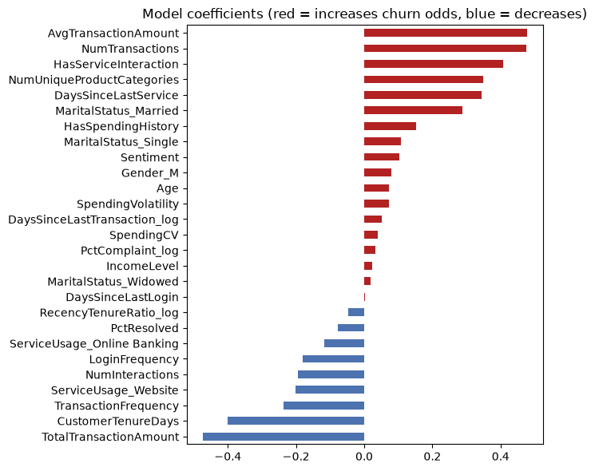

# Customer Churn Prediction

The goal of this project was to predict which of LLoyds Banking Group's customers are likely to churn, enabling preventative action to improve customer retention. Data from LLoyds Banking Group's Forage Data Science Job Simulation was used, including  demographic, transaction, customer-service and online-activity data for 1,000 customers (20.4% churn).

The work is split across two notebooks that run in order:

| # | Notebook | Purpose | Output |
|---|----------|---------|--------|
| 1 | `Data-analysis-and-preparation.ipynb` | Explore the five source datasets, engineer features, analyse churn drivers, clean the data for ML | `data/final_df.csv` |
| 2 | `Churn-Modelling.ipynb` | Compare models and class-imbalance strategies, tune, evaluate on a held-out test set | `models/churn_model.pkl` |

## Project structure

```
.
├── Data-analysis-and-preparation.ipynb
├── Churn-Modelling.ipynb
├── data/
│   ├── Churn_Status.csv            # input
│   ├── Customer_Demographics.csv   # input
│   ├── Customer_Service.csv        # input
│   ├── Online_Activity.csv         # input
│   ├── Transaction_History.csv     # input
│   └── final_df.csv                # generated by notebook 1, read by notebook 2
└── models/
    └── churn_model.pkl             # generated by notebook 2
```

## Setup

```bash
pip install pandas numpy matplotlib scipy scikit-learn imbalanced-learn joblib
```

Place the five input CSVs in `./data/`, then run notebook 1 followed by notebook 2.

## Notebook 1: Data analysis and preparation

1. **Understand datasets**: missing values, duplicate IDs and distributions for each source file.
2. **Feature engineering**: the transaction and service tables are aggregated to one row per customer and merged with demographics, online activity and the churn label.
3. **EDA**: correlation of every feature with churn.
4. **In-depth analysis** of each dataset (demographics, transactions, service, online activity).
5. **Anomaly detection and key insights**: highest-churn segments, red flags, recommended actions.
6. **Data cleaning for ML**: outlier handling, skew-aware scaling, imputation, encoding. Saves `final_df.csv`.

### Engineered eatures

| Source | Features |
|---|---|
| Transactions | `NumTransactions`, `AvgTransactionAmount`, `TotalTransactionAmount`, `NumUniqueProductCategories`, `SpendingVolatility`, `CustomerTenureDays`, `TransactionFrequency`, `DaysSinceLastTransaction`, `HasSpendingHistory`, `SpendingCV`, `RecencyTenureRatio` |
| Customer service | `NumInteractions`, `PctResolved`, `PctComplaint`, `Sentiment`, `NumUnresolved`, `DaysSinceLastService`, `HasServiceInteraction` |
| Online activity | `LoginFrequency`, `DaysSinceLastLogin`, service-usage type |
| Demographics | `Age`, `Gender`, `MaritalStatus`, `IncomeLevel` |

### Missing-data handling

Some values are missing for a reason, not at random, so they are not filled with a placeholder like the maximum or zero:

- `DaysSinceLastService` is undefined for customers who never contacted support. A boolean flag, `HasServiceInteraction`, records this.
- `SpendingVolatility` (and `SpendingCV`) is undefined for customers with a single transaction. A boolean flag, `HasSpendingHistory`, records this.
- The missing values are then imputed in section 6.1 with `IMPUTE_METHOD = 'knn'`. `ChurnStatus` is never used in the imputation, and service-derived columns are excluded when imputing service recency so the neighbours are meaningful.

### Key EDA findings

**Data overview**

- 1,000 customers with no duplicate or missing IDs in the demographics, online activity and churn files.
- Transactions: 5,054 rows, so 1 to 9 per customer. Every customer has at least one transaction.
- Customer service: 1,002 interactions, but 332 customers (33%) have none. This is the group that used to be filled with a fake "360 days since last service".
- Overall churn rate is **20.4%** (204 churned, 796 retained), so the classes are moderately imbalanced.

**Correlation with churn (top 5)**

| Feature | Dataset | Correlation |
|---|---|---|
| `DaysSinceLastService` | Customer service | 0.12 |
| `LoginFrequency` | Online activity | -0.08 |
| `AvgTransactionAmount` | Transactions | 0.04 |
| `HasSpendingHistory` | Transactions | 0.04 |
| `HasServiceInteraction` | Customer service | 0.04 |

**Churn rate by segment (overall: 20.4%)**

| Area | Higher-churn segment | Lower-churn segment |
|---|---|---|
| Demographics | Married 23.0%, Low income 22.2%, age 56-69 22.2% | Divorced 18.5%, High income 19.2% |
| Transactions | Average spend 295-497: 24.8%; total spend 627-1,233: 25.2%; tenure 256-314 days: 23.8%; 2 product categories: 25.0% | 1 unique product category: 16.6%; no spending history: 16.2% |
| Customer service | Sentiment of -1 (all complaints, none resolved): 29.2%; exactly 1 interaction: 24.0%; all interactions complaints: 24.2% | No interactions: 18.4%; sentiment of -0.5 or 0.5: about 16% |
| Online activity | Bottom quarter of login frequency (13.75 or fewer): 23.6%; Mobile App users: 23.1%; 92+ days since last login: 22.4% | Website users: 17.8% |

**Anomalies and red flags**

- **Unresolved complaints:** 65 customers have 100% unresolved interactions, and their churn rate is 29.2%. This is the strongest segment in the data, but it is a small group: the 95% confidence interval is roughly 20% to 41%, so it is suggestive rather than conclusive.
- **Unresolved interactions generally:** 411 customers (41%) have at least one, and their churn rate is only 20.9%.
- **Complaint and unresolved:** 200 customers (20%) have both, with 22.0% churn.
- **Spending volatility outliers:** 8 customers have extreme volatility, and 37.5% of them churned.
- **Spending CV (volatility relative to usual spending) outliers:** 17 customers have extreme volatility relative to their average spending amount, and 41.2% of them churned.
- **Low-churn outliers:** unusually short-tenure customers (5.6% of the base, under about 124 days) churn at 10.7%, and unusually high-frequency customers (1.5%) at 6.7%. Both groups are less likely to churn than average.

**What this means**

- The differences between segments are mostly a few percentage points on groups of roughly 100 to 300 customers, which is within what random variation produces at this sample size.
- The clearest candidates for follow-up are login frequency, unresolved complaints and mobile-app usage. None of them is strong enough on its own to predict churn, which is why modelling is the suggested next step.

## Notebook 2: Modelling

1. Load `final_df.csv` and check class balance.
2. Stratified 80/20 train/test split.
3. Cross-validate (5-fold stratified) every combination of:
   - **Models**: Logistic Regression, Decision Tree, Random Forest, Gradient Boosting, KNN, SVM (calibrated), Neural Network
   - **Imbalance strategies**: none, random oversampling, SMOTE, random undersampling, and class weights where the model supports it
4. Take the top 3 combinations by F1 and tune each with a grid search (F1, 5-fold CV).
5. Score the three tuned candidates on the test set, pick the best, and report the classification report, confusion matrix and feature importance/coefficients.
6. Save the winning pipeline with `joblib`.

Scaling and resampling happen inside an `imblearn` pipeline, so they are fitted on the training folds only.

Load the saved model with:

```python
import joblib
model = joblib.load('./models/churn_model.pkl')
churn_probability = model.predict_proba(X_new)[:, 1]   # X_new needs the same columns as final_df.csv minus ChurnStatus
```

## Results

Test set: 200 customers, 41 of whom churned.

| Model + strategy | CV F1 | Test precision | Test recall | Test F1 | Test ROC-AUC |
|---|---|---|---|---|---|
| Logistic Regression + Random Undersampling (selected) | 0.330 | 0.214 | 0.537 | 0.306 | 0.527 |

The confusion matrix reveals critical business implications with 78 true negatives (correctly identified loyal customers), 22 true positives (successfully flagged churners), 81 false positives (loyal customer incorrectly flagged), and 19 false negatives (missed churners). The model successfully identifies 22 out of 41 actual churns, representing a 53.7% churn prevention opportunity.

## Imbalanced Dataset Considerations

The traditional evaluation metric of accuracy was avoided due to its misrepresentation of performance on an imbalanced dataset. Instead, F1-score, precision, and recall, were highlighted to provide a comprehensive view of model effectiveness for minority class prediction.

## Feature Importance for Business Insight



The model coefficients show which features push churn predictions up or down. The largest contributors to higher predicted churn were average transaction amount, number of transactions and whether the customer had contacted customer service. The largest contributors to lower predicted churn were total transaction amount, customer tenure and transaction frequency. Five of these six features come from the transaction data, but they are strongly related to each other (total spend is roughly the number of transactions times the average), so their individual coefficients should be read together rather than as separate drivers. More consistent signals across the EDA and the model were lower login frequency, Mobile App use and unresolved service complaints, which are the most practical places to focus retention efforts.

## Limitations and interpretation

**The current model has relatively poor predictive power.**

- Test ROC-AUC is 0.53 for the selected model
- Flagging *every* customer as a churner would already give F1 of about 0.34 with 20.4% churn. The best CV F1 of 0.352 just beats that baseline, so not much above chance.
- The learning from the model coefficients is still valuable, but should be treated as hypotheses to test rather than proven causes of churn.

Other points to be aware of:

- **Small test set.** With 41 churners, test metrics are noisy, and differences between the three candidates are within noise.
- **Preprocessing fitted before the split.** Scaling, outlier caps and KNN imputation in notebook 1 are fitted on all rows. No target information is used, but the test set influences the preprocessing slightly. For a fully clean evaluation, these steps would be moved into the modelling pipeline.
- **Default threshold.** Predictions use a 0.5 probability cutoff. The threshold can be tuned from `predict_proba` to trade false alarms against missed churners.

## Suggested next steps

- Use ROC-AUC and PR-AUC (average precision) as the headline metrics, alongside lift in the top decile, rather than F1 alone.
- Check whether more or better data is available (for example, time-based behaviour changes, contract or pricing information, reasons for service contacts). The current features may simply not contain the churn signal.